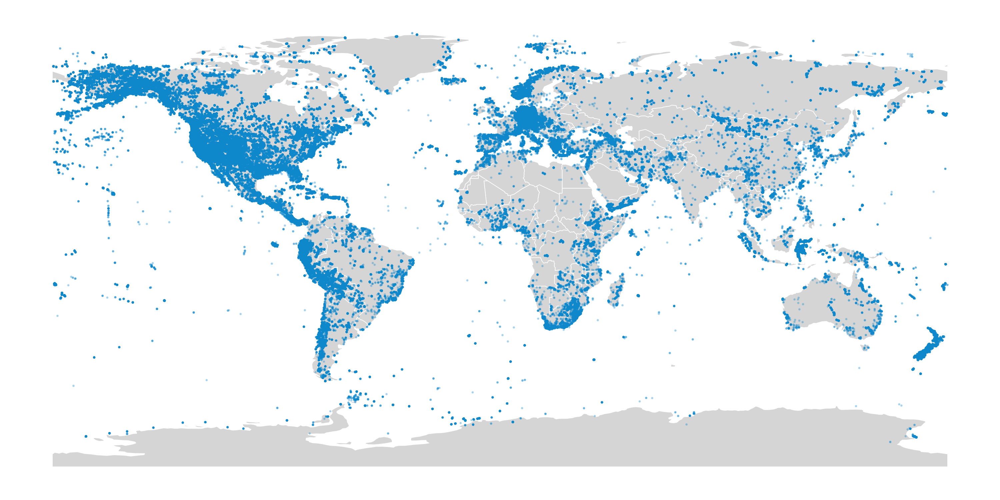
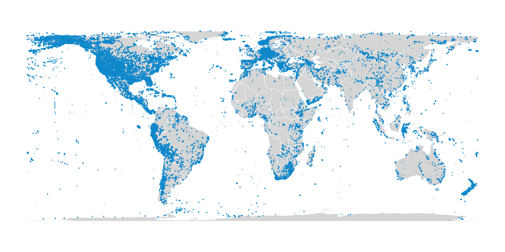

# Create map of GGBN georeferenced samples

## Procedure

1. Download `taxa_coordinates_ggbn.zip` from the [GGBN Data Portal](http://www.ggbn.org/ggbn_portal/documents/taxa_coordinates_ggbn.zip). Unzip the file to obtain the SQL file `Amanda.sql` 🙂

2. Create a blank SQLite database (e.g. `ggbn_localities.sqlite`).

3. In the SQLite database, run the SQL code in `create_table_Amanda.sql` to create an empty table named `Amanda`

	~~~
	.read create_table_Amanda.sql
	~~~
	
4. Read the SQL code in `Amanda.sql`. This inserts the GGBN record data into the table.

	~~~
	.read Amanda.sql
	~~~
	
5. Create an empty file called `sample_coordinates.tsv`, then export sample coordinates to this file with the SQL code in `query_sample_coordinates.sql`.

	~~~
	.headers on
	.mode tabs
	.once sample_coordinates.tsv
	.read query_sample_coordinates.sql
	~~~
	
6. To create a map with a Mercator projection, run the R code `create_map_mercator.R`.
- Change the export filename at the end of the code to the current YYYY-MM.

	~~~
	Rscript create_map_mercator.R
	~~~

7. To create a map with a Lambert cylindrical equal-area projection (not biased towards the poles), run the R code `create_map_lambert.R`.
- Change the export filename at the end of the code to the current YYYY-MM.

	~~~
	Rscript create_map_lambert.R
	~~~
	
## Output maps

### Mercator

### Lambert

